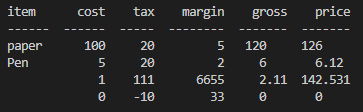

# Cost Calculator

My Cost Calculator is a program to project managers to easily keep track of ongoing costs to a project.

For example, Love Maths is a site that hopes to demonstrate how pure JavaScript works in a real-world context. The site will be targeted toward people who not only love to implement more advanced JavaScript concepts but also maths. Love Maths is a fully responsive JavaScript maths game that will allow users to add, subtract, multiply and divide numbers. 

[Live site Link](https://cost-tracker-ci.herokuapp.com/)  
[Workflow design](https://lucid.app/documents/embedded/e756fa59-d122-44f1-85af-31b39b35ce3f?invitationId=inv_7a6ed2b7-b615-4b97-ba5c-a47263def9a8#)

## Features 

The program allows users to Add items to the calculator, from there you can Delete the item, Calculate the VAT and Print, Calculate the margin and Print. When first loading the terminal you will set the Global Vat and Margin rates.

The objects added will be stored and retrieved from an external database.

## Libraries Used
- gspread - Used as an API to interface with googlesheets.
- Credentials - Used for Authentication to access our googlesheet
- copy - Used to make copies of our data for use in Functions without possibility of affecting the sheet.
- tabulate - Used to print in an easily readable manner.
- datetime - Used record dates entered, potential future use for manually entered dates.

## User Experience
### User Stories
#### Visitor Goals
- As a first time user, I want easily understand the main purpose of the website.
  - Opening text explains function and actions that can be taken.  

- As a first time user, I want to be able to easily see the options.
  - On loading you are presented with a list of options.  

- As a first time user, I want to be able to select set VAT and Margin rates for each cost.
  - Each item has an associated VAT and Margin rate that is entered with the item.  

- As a returning user, I want to be able retrieve previously entered items.
  - There is an option to print all saved items.  

### Existing Features

  - The UI is a very basic terminal window.
  - Add and store "items", stores on a google sheet.
  - Print stored items, uses tabulate for readability.
  - Delete items, Items kept in backend just not printed.

### Features Left to Implement

- Add way to exit out of function.
- Add a date object to database, user input.
- Add a total row when printing.
- Add Excel file import and export function, impossible with current frontend.

### Validator Testing 

- Python
    - All PEP8 Errors found by CI Python Linter fixed, mainly white space and indentation. [CI Python Linter](https://pep8ci.herokuapp.com/) 

## Testing & fixed bugs

- Manual testing done with each function as they are created to ensure they return expected values.
    - Add google API and test, pushing and pulling data from sheet my manually adding data to sheet and console logging it.
    - Add function for calculating vat, test by manually giving number to work on, duplicate for margin function and same testing.
    - Add basic print function and test by printing to console, implement tabulate further manual terminal testing.
    - Add first iteration of Main function, test all 3 functions to make sure they still correctly interact with the data and preform as expected.
    - Main function rewritten to use While True, improving ease of future feature implementation, all previous test reDone. (Wish I'd known/used JEST...)  

- Testing of number inputs, first iteration stopped program when non-numbers were entered, changed to provide error feedback and restart. [commit](https://github.com/EMarnus/MyCostTracker/commit/c955305574d933fbe153e421d33e1559583ccbea)  
  
- Deployed site failed to work, unused dateutil. Import removed.
- Able to input blank as item name. 
  - Added input validation & limit to printing 2 decimals. [commit](https://github.com/EMarnus/MyCostTracker/commit/0867a14ea5412b8e253080d62c9ba473ca6902f8) 
  -     
  
- When trying to print while the sheet is empty, an error ends the program.
- When trying to delete an item while the sheet is empty, an error ends the program.
    - Both print and delete errors were fixed but adding a check for the database, [commit](https://github.com/EMarnus/MyCostTracker/commit/6ccd38bc8930f48c721aae8824aa7ee4614c9358)  
    

- Further testing found that if you delete all items in the database and then try to print you get an error that kills the program. [commit](https://github.com/EMarnus/MyCostTracker/commit/91d267dea2c23a47f4338f246ec7353aba2669cf?diff=split)

- Manual testing to resolve printing and deleting of items with names starting with numbers crashing program revealed that negative VAT and Margin isn't handled. Restricted to only positive numbers. [commit](https://github.com/EMarnus/MyCostTracker/commit/930af21dba755b37cbfd172392c97a8cffead061)

## Deployment

- The site was deployed by Heroku as shown by Code Institute and the repo is on Github. The steps to deploy are as follows: 
  - In the Heroku dashboard, Select "New" then "New App" 
  - Name your app and select appropriate region.
  - Once it's created, go to settings and click the "Reveal Confic Vars" Button, add a pair PORT: 8000 and another CREDS: (the contents of you creds.json file)
  - Add 2 buildpacks, Python and Node.js in that order.
  - Go to the deploy tab, select Github as the Deployment method and link your repo, it should be connected to your profile if you logged in with Github then you just search for the repo name. When the repo popups click "Connect"
  - Under Manual Deploy, click Manual Deploy
  - Finally, once the app has been built you can click "View" and test the deployed app.

The live link can be found here - https://cost-tracker-ci.herokuapp.com/  
The Repository can be found here - https://github.com/EMarnus/MyCostTracker

## Credits 

### Function

- How to use google cloud APIs take/learnt from Code Institute Love Sandwich project
- Help in Printing data from workbook, https://www.educba.com/python-print-table/ and https://stackoverflow.com/questions/42235918/python-tabulate-dictionary-containing-two-values-per-key
- Updating single cell on google sheet using a string as ref, https://stackoverflow.com/questions/71029282/update-value-in-google-sheet-with-if-condition-in-another-column-using-python
- Input number function from https://www.101computing.net/number-only/